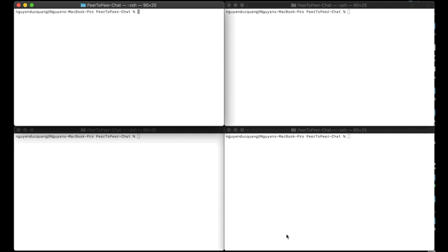

# Peer-to-Peer Chat program
In this P2P chat program, there is no server. Each node inside acts as both the server and the client. It is implemented 
using C Socket API, hash algorithm, and multi thread programming. 

# Instruction
## 1. Compilation:
> rm p2pchat

This command remove the previously compiled p2pchat if there are any.

> make 

## 2. Starting the chat:
> ./p2pchat Username

For example: 
> ./p2pchat Alice

The terminal will print out message such as **INFO: Alice at address 127.0.0.1 is listening at 55107**. 
55107 is the **port_number** that Alice is currently listening to. 127.0.0.1 is the **chatroom_IP**. Other node can connect 
to the network via this **port_number** and **chatroom_IP**.

## 3. Joining the chat:
> ./p2pchat Username chatroom_IP port_number

The **chatroom_IP** and the **port_number** is the IP and port of **any node** in the chatroom. 

For example: 
>./p2pchat Bob localhost 55107 

would connect Bob with Alice chat room mentioned above.

## 4. Quit the chat:
To quit the chat, type **:p** into the chat box.

# Demo

